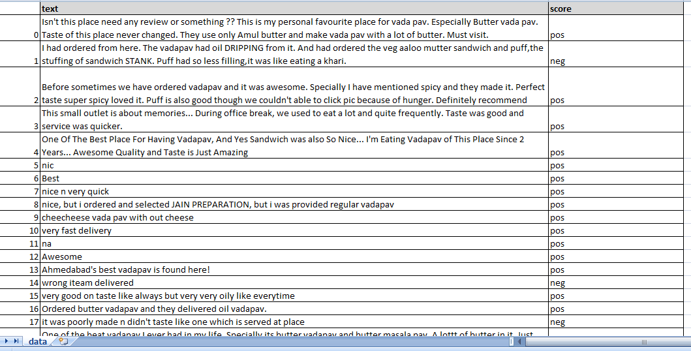

# zdatademo
this is zomato data scrapping script

This script is divided into two parts 

<ul>
<li>1. Get data from zomato website </li>
<li>2. Get Sentiment analysis from reviews </li>
</ul>

<h2>1. Get data from zomato website</h2>

We have created Zdata Class which has url and html_text attributes
We will parse html link using beautifulSoup, once we get html data

We will call <b>get_reviews()</b> method :  
-> This method load html content with URL + '/reviews' page of that Restaurant 
-> We will look for Tab which says 'All Reviews'  
-> WE will click on that tab and wait for few seconds to load reviews 

Another function <b>load_all_reivews()</b> will take html and search repetitively for 'load more' options on page.
It will load all reviews
 
Once we have reviews we will parse reviews and get below mentioned data
 
<ul>
 <li> Ratings </li>
 <li> SentimentScore (optional) </li>
 <li> Reviews </li>
 <li> Author </li>
 <li> date/time </li>
 <li> Likes </li>
 <li> Comments </li>
</ul>

We will store all data into json file.

<h2>2. Get Sentiment Analysis from reviews</h2>

VADER( Valence Aware Dictionary for sEntiment Reasoning ) is model used for text sentiment analysis that is sensitive to positive and negative polarity and intensity of emotion.

VADER is available with NLTK package and can be applied directly to unlabeled text data. VADER sentiment analysis relies on dictionary which maps lexical features to emotions intensities called sentiment scores. The sentiment score of text can be obtained by summing up the intensity of each word in text.

For example , words like ‘love’ , ‘like’ , ‘happy’ all convey positive sentiment. but ‘hate’ , ‘ignore’, ‘worst’ convey negative sentiments. VADER is intelligent enough to understand basic context of these words such as ‘did not love’ as negative sentiments.

Let’s explore VADER Sentiment Analysis with NLTK and python

First of all we will import nltk library and download vader_lexicon data set and create object for SentimentIntensityAnalyzer

After that we have loaded review from csv file for amazon reviews and used VADER analysis to get positive or negative analysis.

Based on Analysis we get Sentiment analysis as mentioned below :

